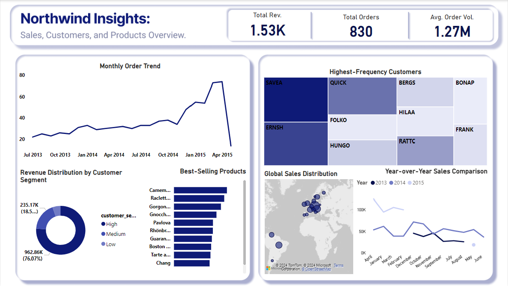

# Northwind Sales Analytics: Uncovering Customer Insights and Operational Efficiencies

This project provides an in-depth analysis of Northwind Traders' sales data, focusing on customer behavior, product performance, shipping efficiency, and seasonal trends. Using Python for data cleaning, transformation, and exploratory data analysis (EDA) in a Jupyter Notebook, and Power BI for interactive visualizations, the analysis uncovers actionable insights to drive business decisions.

  
*(Screenshot of the Power BI dashboard highlighting key metrics like total revenue (1.53K), orders (830), and visualizations for trends, customer segments, and global sales.)*

## Technologies Used
- **Programming:** Python (Pandas for data manipulation, Seaborn/Matplotlib for visualizations)
- **Tools:** Jupyter Notebook for EDA, Power BI for dashboard creation
- **Data Handling:** CSV imports, date conversions, merging datasets
- **Other:** Feature engineering (e.g., customer segmentation, days-to-ship calculation)

## Data Preprocessing
### Datasets Used
- **Orders:** Details on orders, including dates, freight costs, and customer info.
- **Customers:** Customer contact details, locations, and company info.
- **Products:** Product names, categories, prices, and suppliers.
- **Order Details:** Per-order specifics like products, quantities, and discounts.

### Key Preprocessing Steps
1. **Project Setup:** Imported libraries (Pandas, Seaborn, Matplotlib).
2. **Data Loading:** Loaded datasets with 'latin-1' encoding to handle special characters.
3. **Initial Inspection:** Summarized data properties (info(), describe()), converted date columns to datetime, and handled missing values in `shippedDate` (filled with `requiredDate` as proxy).
4. **Data Quality:** Identified/handled outliers (e.g., in Freight and UnitPrice), ensured ID consistency across datasets.
5. **Merging & Feature Engineering:** 
   - Merged all datasets into one for holistic analysis.
   - Renamed columns for clarity.
   - Created features: `total_order_value` (unitPrice * quantity * (1 - discount)), `days_to_ship` (shippedDate - orderDate).
   - Segmented customers into Low, Medium, High based on total spend using quantiles.

## Exploratory Data Analysis (EDA)
- **Customer Loyalty:** Top customers by order count (e.g., SAVEA with 31 orders).
- **Product Popularity:** Top products by quantity sold (e.g., Camembert Pierrot at 1,577 units).
- **Customer Segmentation:** Analyzed preferences by segment (e.g., High-spend prefers Camembert Pierrot).
- **Shipping Analysis:** Average days to ship per product (e.g., Sir Rodney's Marmalade at ~17 days).
- **Order Frequency:** Monthly trends showing peaks in late 2014/early 2015.
- **Average Order Value:** Varied by segment (High: $750, Medium: $399, Low: $240).

Results were exported to `northwind_analysis.csv` and `.xlsx` for sharing.

## Power BI Visualization
The dashboard visualizes key insights:
- **Monthly Order Trend:** Line chart of orders from July 2013 to April 2015, showing seasonal peaks.
- **Revenue Distribution by Customer Segment:** Pie chart (High segment: 76.07% of revenue).
- **Best-Selling Products:** Bar chart of top items by sales volume.
- **Highest-Frequency Customers:** Heatmap of loyal customers for targeted marketing.
- **Global Sales Distribution:** Map showing active regions.
- **Year-over-Year Sales Comparison:** Line chart comparing 2013–2015 trends.

## Key Findings & Actionable Insights
- **Focus on High-Value Customers:** The "High" segment drives most revenue—prioritize retention strategies.
- **Optimize Inventory:** Stock best-sellers like Camembert Pierrot to meet demand.
- **Improve Shipping:** Address delays in certain products to boost satisfaction and repeat business.
- **Capitalize on Seasons:** Peaks at year-end suggest effective promotions during these periods.

## How to Run
1. Clone the repo: `git clone <repo-url>`.
2. Install dependencies: `pip install pandas seaborn matplotlib`.
3. Open the Jupyter Notebook: `Northwind/Northwind  Sales Data Analysis.ipynb`.
4. For Power BI: Open the `Northwind/Northwind Insight Project.pbix` file 

## Future Improvements
- Integrate SQL for data querying.
- Add predictive modeling (e.g., forecast sales using time-series analysis).
- Expand to real-time data integration.

